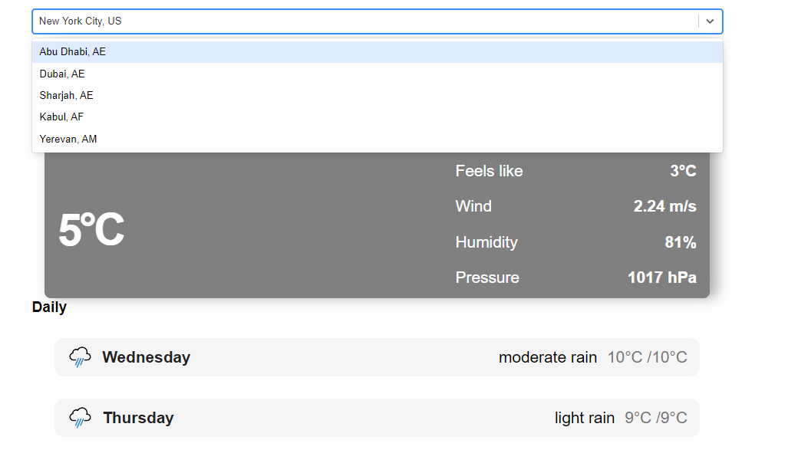

# 
 MERN Weather App

## 
Teach Stack
 
 
React js

 
API used : GeoDB cities, Open weather api

## 
 Features 

 <ol>
   <li> Search Specific weather of city</li>
 <li>current weather of the city</li>
 <li>shows daily weather forecat</li>
 </ol>

 ## 
 Screenshots 

 
 
1. Search bar with dynamic cities 

 
 
 
 current weather 

 
 
 
 Daily weather forecast 

